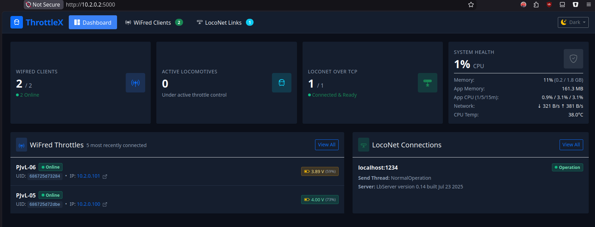

# ThrottleX
**wiThrottle to LocoNet converter with webserver**



Normal Usage:

Download the .deb file from the release page. Upload it to your Raspberry Pi. 
Example
```shell
scp throttle-x-0.8.1-arm64.deb piuser@10.2.0.2:.
```
Then log on to your Raspberry Pi and install the .deb file.
```shell
sudo dpkg -i throttle-x-0.8.1-arm64.deb
```
This installation process creates a system user and also a service that will automatically start the application when the Raspberry Pi boots.
When the Pi has booted up open a browser and enter the ipaddress of the PI and port 5000 to open the ThrottleX Dashboard.
For example http://10.2.0.2:5000
